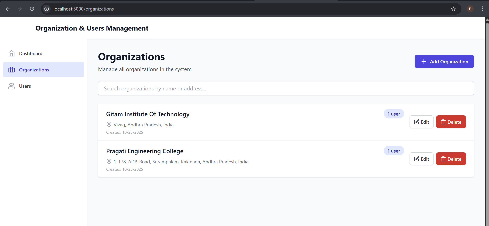
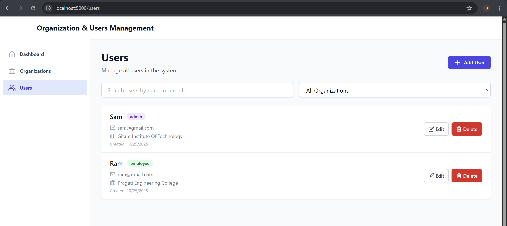
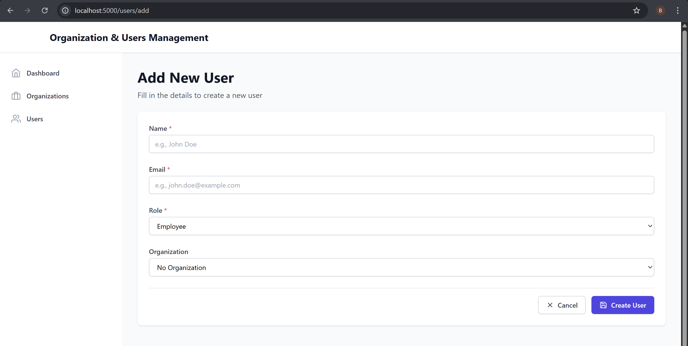
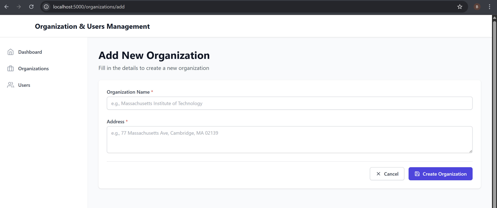
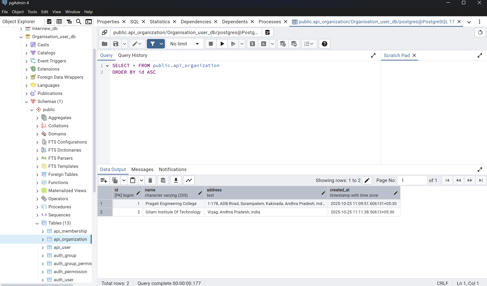
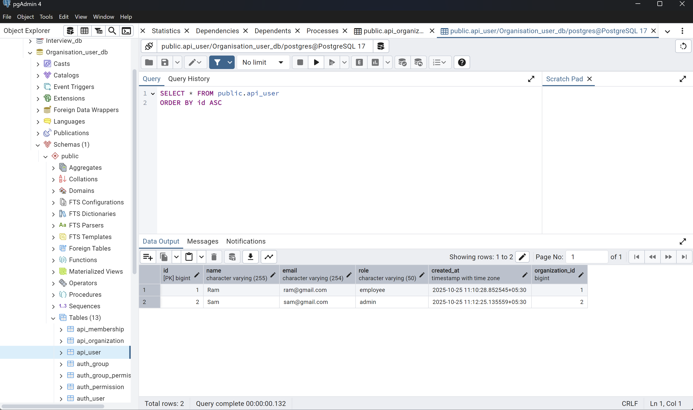

🧑‍💻 **Organization & Users Management**  

📌 **Problem**  
Managing users and organizations manually can be error-prone, time-consuming, and lacks structured oversight — especially in scenarios involving multiple organizations with different roles and memberships.  

💡 **Solution**  
We developed a full-stack web application to automate and streamline user and organization management. The platform allows administrators to manage organizations, assign users with specific roles, and maintain memberships efficiently, with a responsive and intuitive interface.  

👨‍💻 **My Role**  
As a key member of the project, I:  
- Implemented backend APIs using **Django REST Framework** to handle CRUD operations for organizations and users.  
- Developed a **dynamic React frontend** to provide a seamless UI for administrators and users.  
- Integrated the frontend with backend REST APIs for real-time data operations.  
- Ensured role-based access control and membership management logic.  

🚀 **Impact**  
- Streamlined the process of managing organizations and users.  
- Reduced administrative effort and improved data integrity.  
- Enabled role-based access and clear organizational hierarchy for better management.  

⚙️ **Tech Stack**  
- **Backend:** Django REST Framework  
- **Frontend:** React  
- **Database:** SQL (SQLite/PostgreSQL)  
- **Other Tools:** REST APIs, Postman for testing  

✨ **Key Features**  
- **Organization Management:** Create, read, update, and delete organizations.  
- **User Management:** Manage users with role assignments.  
- **Membership System:** Associate users with multiple organizations.  
- **Role-Based Access Control:** Different functionality and views for Admins and Users.  
- **Responsive Design:** Fully responsive UI using grid system and spacing according to design visuals.  

🖥️ 📸**User Interface & Screenshots**  

---

